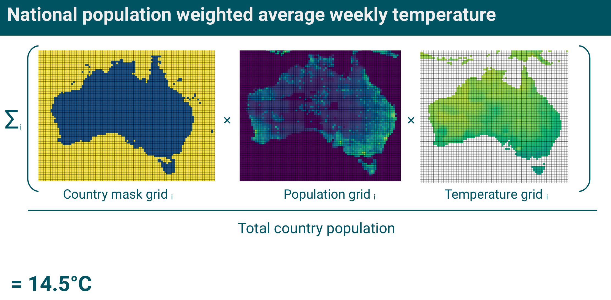

# Timeseries of weekly population weighted average temperatures anomalies by country

Jonas Schöley. cc-by. Last updated: 2023-10-19

MOCY provides time series of weekly death counts stratified by country, sex, and age along with useful covariates such as person-weeks exposure time, population-weighted weekly temperature, and public holiday indicators.

This repository contains the source files needed to compile the MOCY database. The compiled data is hosted at [osf.io/k84rz](https://osf.io/k84rz/).

## Sources

Weekly population-weighted average temperature by country and year calculated from:

- Global gridded population 2010 [1]
- Global national grid embedded in [1]
- Daily global gridded temperature [2]

[1]: Center for International Earth Science Information Network - CIESIN - Columbia University. 2018. Gridded Population of the World, Version 4 (GPWv4): Population Count, Revision 11. Palisades, NY: NASA Socioeconomic Data and Applications Center (SEDAC). https://doi.org/10.7927/H4JW8BX5.

[2]: CPC Global Temperature data provided by the NOAA/OAR/ESRL PSL, Boulder, Colorado, USA, from their Web site at https://psl.noaa.gov/. <https://psl.noaa.gov/data/gridded/data.cpc.globaltemp.html>

## Variable description

`/out/tanomaly.csv`

### id variables

- `id`:
  uniquely identifies rows;
  pattern: <region_iso, year, week>

### strata

- `region_iso`:
  ISO 3166-1 alpha-2 country code
- `year`:
  year as defined in ISO 8601 week date system
- `week`:
  week as defined in ISO 8601 week date system [0, 53]

### additional region information

- `region_name`:
  natural name of region

### observations

- `traw`:
  average temperature in given week and region in degrees Celsius
- `twgt`:
  population-weighted average temperature in given week and region in degrees Celsius
- `twgt_rsd`:
  population-weighted average temperature anomaly in given week and region in degrees Celsius
- `twgt_zsc`:
  population-weighted average temperature anomaly z-score in given week and region in degrees Celsius